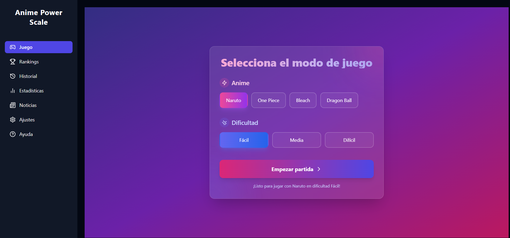
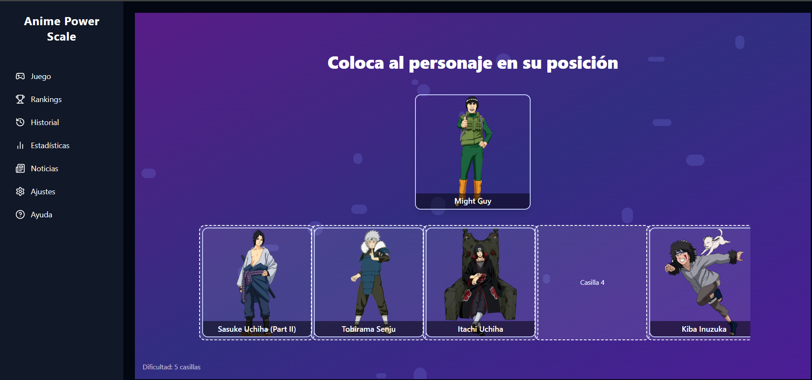
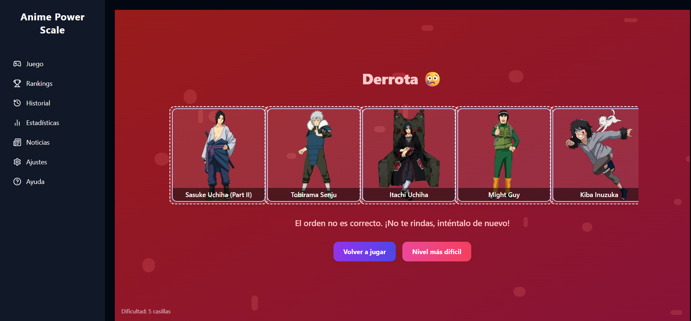
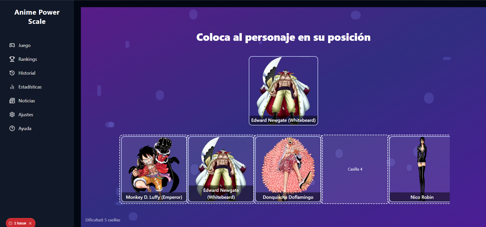
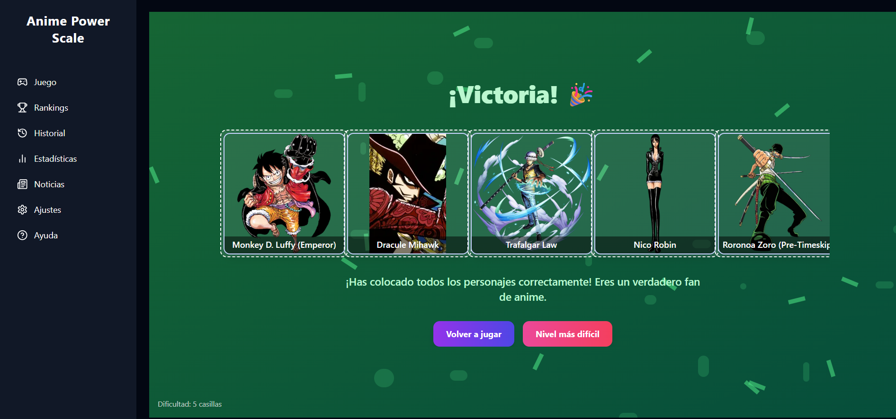

# AnimePowerScale 🎮

A dynamic anime character power scaling game where players test their knowledge of character strength rankings from popular anime series.

## 🎯 What is AnimePowerScale?

AnimePowerScale is an interactive web-based game that challenges players to correctly order anime characters by their power levels. Players drag and drop character cards into slots, attempting to arrange them from weakest to strongest based on their tier rankings.

## ✨ Features

### 🎮 Core Gameplay
- **Drag & Drop Mechanics**: Intuitive character placement using HTML5 drag and drop
- **Multiple Anime Series**: Support for Naruto, One Piece, Bleach, and Dragon Ball
- **Progressive Difficulty**: Three difficulty levels (Easy: 5 slots, Medium: 7 slots, Hard: 9 slots)
- **Real-time Validation**: Instant feedback on character placement accuracy
- **Dynamic Character Loading**: Characters are fetched and parsed from anime databases

### 🏆 Competitive Features
- **Global Rankings**: Track victories across different anime series and difficulty levels
- **User Authentication**: Secure login system with NextAuth.js
- **Game History**: View your past matches and performance
- **Statistics Dashboard**: Comprehensive stats and analytics
- **Leaderboards**: Compete with other players worldwide

### 📰 Content & Updates
- **Anime News Integration**: Latest news and updates from the anime world
- **Character Database**: Extensive character information with images and wiki links
- **Tier System**: Complex power scaling system with multiple tier categories (1-A to 9-C)

### 🎨 User Experience
- **Modern UI/UX**: Beautiful gradient backgrounds and smooth animations
- **Responsive Design**: Works seamlessly on desktop and mobile devices
- **Visual Feedback**: Color-coded success/failure states and animations
- **Accessibility**: Keyboard navigation and screen reader support

## 🛠️ Technology Stack

### Frontend
- **Next.js 15**: React framework with App Router
- **TypeScript**: Type-safe development
- **Tailwind CSS**: Utility-first styling
- **React DnD**: Drag and drop functionality
- **Lucide React**: Modern icon library

### Backend & Database
- **NextAuth.js**: Authentication system
- **Drizzle ORM**: Type-safe database operations
- **PostgreSQL**: Primary database (Neon serverless)
- **Cheerio**: Web scraping for character data

### Development Tools
- **ESLint**: Code linting
- **Drizzle Kit**: Database migrations and schema management
- **Docker**: Containerization support

## 🚀 Getting Started

### Prerequisites
- Node.js 18+ 
- PostgreSQL database
- npm or yarn package manager

### Installation

1. **Clone the repository**
   ```bash
   git clone https://github.com/yourusername/AnimePowerScale.git
   cd AnimePowerScale
   ```

2. **Install dependencies**
   ```bash
   cd frontend
   npm install
   ```

3. **Set up environment variables**
   ```bash
   cp .env.example .env.local
   ```
   
   Configure the following variables:
   ```
   DATABASE_URL=your_postgresql_connection_string
   NEXTAUTH_SECRET=your_nextauth_secret
   NEXTAUTH_URL=http://localhost:3000
   ```

4. **Set up the database**
   ```bash
   npm run db:generate
   npm run db:push
   ```

5. **Run the development server**
   ```bash
   npm run dev
   ```

6. **Open your browser**
   Navigate to [http://localhost:3000](http://localhost:3000)

## 🎯 How to Play

1. **Select Your Mode**: Choose an anime series and difficulty level
2. **Drag Characters**: Drag character cards from the top to the slots below
3. **Order by Power**: Arrange characters from weakest (left) to strongest (right)
4. **Complete the Challenge**: Fill all slots correctly to win
5. **Track Progress**: View your statistics and rankings

### Game Rules
- Characters must be ordered by their power tier (1-A being strongest, 9-C being weakest)
- Incorrect placement ends the game immediately
- Complete all slots correctly to achieve victory
- Your score is tracked for global rankings

## 📊 Game Modes

### Available Anime Series
- **Naruto**: Ninja world power scaling
- **One Piece**: Pirate strength rankings
- **Bleach**: Soul Reaper power levels
- **Dragon Ball**: Saiyan and warrior strength

### Difficulty Levels
- **Easy**: 5 character slots
- **Medium**: 7 character slots  
- **Hard**: 9 character slots

### 📷 Game Screenshots

Here you can see some screenshots from the app:








## 🔧 API Endpoints

The application includes several API routes for:
- User authentication and registration
- Character data fetching and parsing
- Game mode management
- Match history and statistics
- Global rankings
- Anime news integration

## 🐳 Docker Deployment

```bash
# Build the Docker image
docker build -t animepowerscale .

# Run with Docker Compose
docker-compose up -d
```

## 🤝 Contributing

1. Fork the repository
2. Create a feature branch (`git checkout -b feature/amazing-feature`)
3. Commit your changes (`git commit -m 'Add amazing feature'`)
4. Push to the branch (`git push origin feature/amazing-feature`)
5. Open a Pull Request

## 📝 License

This project is licensed under the MIT License - see the [LICENSE](LICENSE) file for details.

## 🙏 Acknowledgments

- Character data sourced from anime databases and wikis
- Icons provided by [Lucide React](https://lucide.dev/)
- UI components inspired by modern design systems
- Community feedback and testing

## 📞 Support

If you encounter any issues or have questions:
- Open an issue on GitHub
- Check the documentation
- Join our community discussions

---

**Ready to test your anime knowledge? Start playing AnimePowerScale today!** 🎮✨